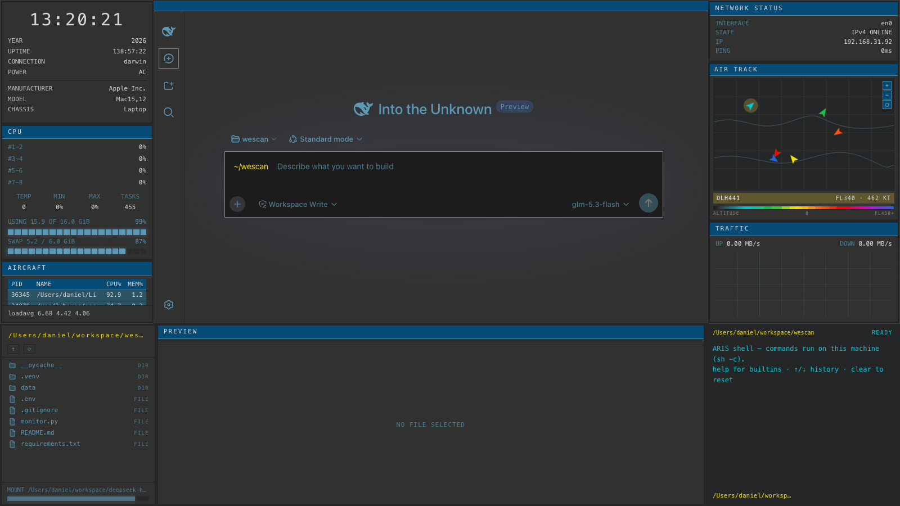
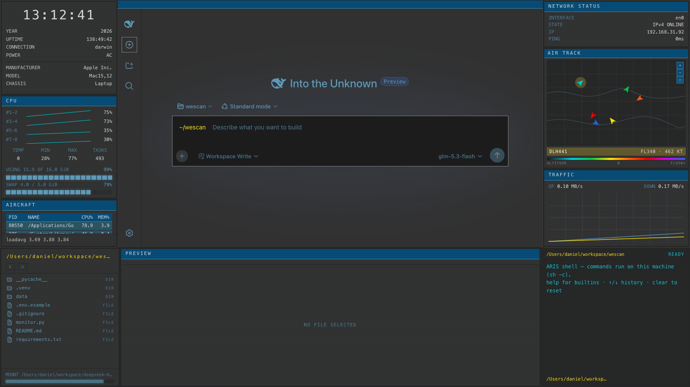

# dsh-edex-airtrack-ui

**AIRTRACK** — an eDEX-UI style shell theme for the DeepSeek Harness web GUI, driven
by the live aircraft-tracking console at [globe.airplanes.live](https://globe.airplanes.live/)
(tar1090-style globe UI). Dark tactical-console chrome wraps the original workspace:
left system bar, right flight bar with the featured **AIR TRACK** map, filesystem
browser, and a terminal-styled composer input.





## Theme

Palette and border language are measured from the reference screenshot
(`analysis.md` / `analysis.json` in this repo):

- **Panel/card surface** `#313131` neutral gray on a **#262626** canvas — flat,
  utilitarian, no glow anywhere
- **Steel-cyan accent** `#5D9AB8` (lifted from the reference's table-row steel
  `#2A5363` family); **header/active bands** `#064B75` with lighter `#4388A0`
  edges — the reference's filled-band active language (no left accent bars)
- **Cards**: full 1px `#242424` rectangles, square corners, hairline dividers
- **Inputs**: dark `#1C1C1C` fields with 1px `#858585` borders
- **Semantic hues** from the reference's altitude legend: green `#00C83C`,
  yellow `#FFE500`, red `#F00000`, blue `#2364E8`, cyan `#00C8D8`
- **Text**: `#D8D8D8` primary / `#BFBFBF` labels / `#858585` muted
- The workspace shares the panel surface (`#313131`) and carries the same card
  chrome (1px border + steel-blue title strip) as the side widgets

## Widget reconciliation

| Reference element | Shell slot | Implementation |
|---|---|---|
| Aircraft data table (steel header band, row fills, amber selected row) | `processes` (left bar, retitled **AIRCRAFT**) | restyled with the reference's table language, live host data |
| Status counters line | `info` (left bar) | labeled live counters, hairline-divided |
| **Tactical map / track display** | featured widget **AIR TRACK** (right bar) | dark graticule field, CSS-drifting multicolored aircraft tracks, amber selected-track readout, altitude gradient legend — replaces the WORLD VIEW globe |
| Map control toolbar / search form / legend | — | folded into the widget chrome + input styling |

## Installation

The plugin is published to npm as `@danielng23/dsh-airtrack-ui`. From the harness
checkout:

```sh
pnpm dsh plugin --profile <profile> add @danielng23/dsh-airtrack-ui
```

or with a local checkout of this repo:

```sh
pnpm dsh plugin --profile <profile> add file:/path/to/dsh-edex-airtrack-ui/packages/bundle
```

Then boot as usual (`pnpm dsh --profile <profile>`). The Appearance settings row
exposes the AIRTRACK steel-cyan accent (`#5d9ab8`); the whole original UI is
recoloured through the alias-token override layer.

## Packages

| Package | Purpose |
|---|---|
| `@danielng23/dsh-airtrack-ui` | the bundle (cordis patch wiring the shell) |
| `@danielng23/dsh-airtrack-client-ui-edex` | the shell frame + widgets (browser half) |
| `@danielng23/dsh-airtrack-client-ui-theme-terminal` | the alias-token theme row |
| `@danielng23/dsh-airtrack-host-system-metrics` | the system-metrics Host Remote |

## Development

```sh
pnpm install
DSH_HARNESS=/path/to/deepseek-harness pnpm build
```

See `WIDGETS.md` for the widget-slot architecture and `analysis.md` for the
full reference analysis.

## License

MIT
